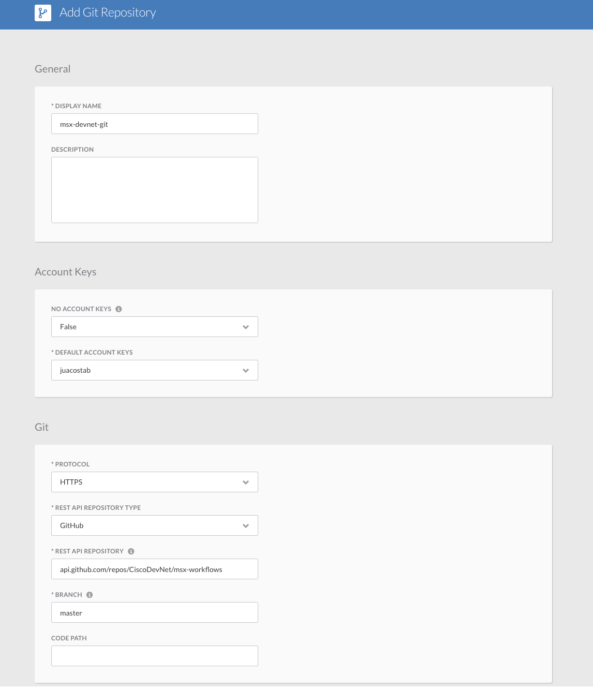

# dnac-automation
This project contains a library of workflows that provides a simple interface to the Cisco DNA Center (DNAC) Intent API.  

## Pre-Requisites
The automation library for DNAC Intent API requires as minimum the follwoing components

* Cisco Action Orchestrator(AO) 5.2.0 +
* Cisco DNA Center(DNAC) 1.3.3.9 +

## Installation

In order to install the workflow library follow the steps listed next

### 1. Add Git Repository to Cisco AO
Add the `github.com/CiscoDevNet/msx-workflow` repository  to your Cisco Action Orchestrator environment

### 2. Create Target
Create one `HTTP Endpont` target per `Cisco DNAC` you want automate

### 3. Import Workflows
The library consists of two groups of workflows. Atomic actions, general purpose workflows containing only adaptor and core 
activities (no subworkflows allowes) and specialized workflows that build upon atomics. The order on which the workflow are imported matter and the general guidance is:
 
1. Import Atomic Workflows first, 
2. Import Regular workflows second 

_*Note:*_ Regular workflows can contain subworkflows that will be imported at the same time.

Use the following AO dialog to import the workflows in the environment
 

#### 3.1 Workflows Included in the Library

##### Atomic Workflows
1. GetAllDevices
2. GetDeviceDetails
2. GetDNACToken
3. GetTaskDetails
4. GetTaskID
5. WaitForTask
##### Regular Workflows
1. CreateCLICredentials
2. CreateSNMPv2Credentials
3. DiscoverDevices
4. GetDeviceInventory

#### 3.2 Import Procedure
Follow the steps described here to successfully import the library

1. Select the `Git Repository`
2. Select from `File Name` the workflow to be imported, e.g. `GetDNACToken`. 
3. Select the `Version` to import
4. _*DO NOT*_ `Select to Clone`
5. Select `Import` button
6. Wait for the workflow to be fully imported.
7. When the state of workflow is `Import Completed`, refresh page
